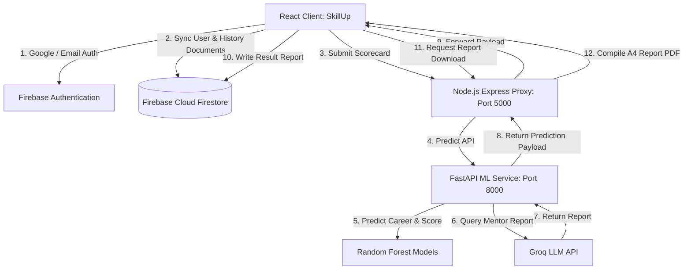

# SkillUp - Student Career Success Predictor & AI Mentor

SkillUp (CareerIQ) is an advanced, production-grade web platform designed for academic institutions to evaluate student competencies, predict placement success readiness indices, identify technical skill gaps, and provide personalized AI mentoring roadmaps.

---

## 🌟 Core Features

- **Success Prediction Engine (ML)**: Uses a trained Random Forest Regressor to output a continuous **Placement Success Readiness Score (0-100)** and relative feature importances based on 10 student ratings (including CGPA).
- **Career Path Classifier (ML)**: Maps student skills into a target career match category (Software Engineer, Data Scientist, DevOps, etc.) with prediction confidence intervals.
- **AI Mentorship & Timeline (LLM)**: Integrates the **Groq API** (`llama3-8b-8192`) to generate 11 sections of personalized mentoring feedback, capstone proposals, and placement action roadmaps.
- **Competency Radar Matrix**: Displays interactive skill matrices using Recharts.
- **Automated A4 Reports**: Compiled on-the-fly and downloaded as styled PDFs containing student metrics and AI reports.
- **Clean Enterprise Appearance**: Structured strictly under a light #F8FAFC theme using modern Figtree typography and an 8-point layout grid.

---

## 🏗️ System Architecture



---

## ⚙️ Project Structure

```text
SkillUp/
├── frontend/             # React SPA (Vite + TypeScript + Tailwind CSS)
│   ├── src/
│   │   ├── components/   # Chatbots, Sidebar, Navbar
│   │   ├── pages/        # Dashboard, Assessment wizard, Results dashboard
│   │   └── services/     # Axios client API routes
│   └── vercel.json       # SPA routing rewrites for Vercel
├── backend/              # Node.js Express middle-tier proxy
│   ├── server.js         # API middleware and PDF compilations
│   └── verify_backend.js # Local integration validation script
├── ml-service/           # FastAPI Machine Learning Microservice
│   ├── main.py           # Endpoint routers & Groq API handlers
│   ├── train_regressor.py# ML training code
│   └── models/           # Pre-fitted Joblib estimators
└── README.md             # Project documentation
```

---

## 🚀 Local Run Guide

### 1. Pre-requisites & Setup
Ensure you have `Node.js (v18+)`, `Python (3.9+)`, and `Git` configured.

### 2. Launch Machine Learning Service
1. Navigate to the microservice folder:
   ```bash
   cd ml-service
   ```
2. Create and activate a Python virtual environment:
   ```bash
   python -m venv venv
   .\venv\Scripts\activate   # Windows
   source venv/bin/activate  # macOS/Linux
   ```
3. Install package dependencies:
   ```bash
   pip install -r requirements.txt
   ```
4. Configure your `.env` variables:
   ```env
   GROQ_API_KEY=your_groq_api_key_here
   ```
5. Launch the Uvicorn dev server:
   ```bash
   uvicorn main:app --host 127.0.0.1 --port 8000
   ```

### 3. Launch Express Backend
1. Navigate to the backend folder:
   ```bash
   cd ../backend
   ```
2. Install node modules:
   ```bash
   npm install
   ```
3. Configure your `.env` variables:
   ```env
   PORT=5000
   ML_SERVICE_URL=http://127.0.0.1:8000
   ```
4. Start the Node.js API:
   ```bash
   node server.js
   ```

### 4. Launch React Client
1. Navigate to the frontend folder:
   ```bash
   cd ../frontend
   ```
2. Install client dependencies:
   ```bash
   npm install
   ```
3. Launch the Vite local dev server:
   ```bash
   npm run dev
   ```
4. Open your browser and navigate to **`http://localhost:5173/`**.

---

## ⚡ Deployment Guidelines

### Frontend (Vercel)
The React client is configured to build on Vercel using the root folder **`frontend`** with output directory **`dist`**. SPA rewrites are fully integrated via `vercel.json` to prevent 404 router errors.

- Live URL: **[https://skillup2026.vercel.app](https://skillup2026.vercel.app)**
